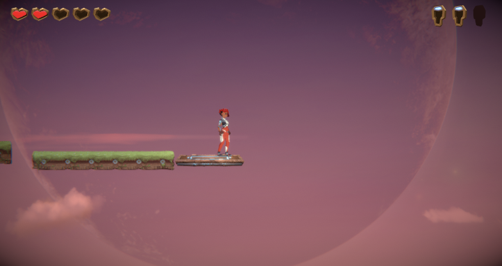

[](https://classroom.github.com/a/YyUO0xtt)
# COMP2150  - Level Design Document
### Name: Koray Zirh
### Student number: 47543833

Your document must include images. To insert an image into your documentation, place it in the "DocImages" folder in this repo, then place the below text where you want the image to appear:

```

```

Example:



## 1. Player Experience (~700 words)
Outline and justify how your level design facilitates the core player experience goals outlined in the assignment spec. Each section should be supported by specific examples and screenshots of your game encounters that highlight design choices made to facilitate that particular experience.

### 1.1. Discovery
What does the player learn? How does your encounter and broader level design facilitate learning in a way that follows good design practice?

In my level, the player is periodically introduced to new mechanics and aspects of the terrain, both shifting and changing in scope and difficulty as the player moves through the level itself. Specifically, the first discovery of moving platforms is introduced with a simple single platform, then the player is immediately put into a situation where they must rely on their newfound understanding around how the platforms move in unexpected directions and alternate speeds from one another. Much of the level relies on the player grasping different ways to counter these strangely moving platforms. The assumptions around the player's ability come into play whilst also allowing for necessary moments of agency and independent decision making in order to progress throughout the level, such as the portions where freefalling to an unseen portion of the map is required.

### 1.2. Drama
What is the intensity curve? How does your design facilitate increasing yet modulating intensity, with moments of tension and relief?

Between portions of added difficulty and introduction of game mechanics I have opted to use checkpoints on flat land to allow the player to rest. As aforementioned, upon entry the player is introduced to moving platforms and a weapon where they can learn to adjust accordingly depending on the natural direction the terrain requires them to move. Moments in between challenges can be used to explore these new mechanics before the next portion of the game will directly implement the use of the gained weapon, for example. As the level progresses, the difficulty increases through volume of enemies/obstacles encountered. For example, all enemies introduced prior to the enemy spawn arena portion of the game allows the player to discover the use of the gun for spitters while use of the staff for chompers is also learned. After several opportunities to demonstrate their capabilities, they are then met with the arena as a 'face-off' situation occurs before allowing them to pass to the next area and obtain the next key.

### 1.3. Challenge
What are the main challenges? How have you designed and balanced these challenges to control the difficulty curve and keep the player in the flow channel?


### 1.4. Exploration
How does your level design facilitate autonomy and invite the player to explore? How do your aesthetic and layout choices create distinct and memorable spaces and/or places?

## 2. Core Gameplay (~400 words)
A section on Core Gameplay, where storyboards are used to outline how you introduce the player to each of the required gameplay elements in the first section of the game. Storyboards should follow the format provided in lectures.

Storyboards can be combined when multiple mechanics are introduced within a single encounter. Each section should include a sentence or two to briefly justify why you chose to introduce the mechanic/s to the player in that sequence.

You should restructure the headings below to match the order they appear in your level.

### 2.1. Passthrough Platforms
### 2.2. Checkpoints
### 2.3. Weapon Pickup (Staff)
### 2.4. Acid
### 2.5. Moving Platforms
### 2.6. Keys
### 2.7. Health Pickups
### 2.8. Weapon Pickup (Gun)
### 2.9. Spikes
### 2.10. Chompers
### 2.11. Spitters


## 3. Spatiotemporal Design
A section on Spatiotemporal Design, which includes your molecule diagram and annotated level maps (one for each main section of your level). These diagrams may be made digitally or by hand, but must not be created from screenshots of your game. The annotated level maps should show the structure you intend to build, included game elements, and the path the player is expected to take through the level. Examples of these diagrams are included in the level design lectures.

No additional words are necessary for this section (any words should only be within your images/diagrams).
 
### 3.1. Molecule Diagram

### 3.2. Level Map – Section 1

### 3.3.	Level Map – Section 2

### 3.4.	Level Map – Section 3

## 4. Iterative Design (~400 words)
Reflect on how iterative design helped to improve your level. Additional prototypes and design artefacts should be included to demonstrate that you followed an iterative design process (e.g. pictures of paper prototypes, early grey-boxed maps, additional storyboards of later gameplay sequences, etc.). You can also use this section to justify design changes made in Unity after you drew your level design maps shown in section 3. 

You should conclude by highlighting a specific example of an encounter, or another aspect of your level design, that could be improved through further iterative design.

**Additional Notes:** Example Text
